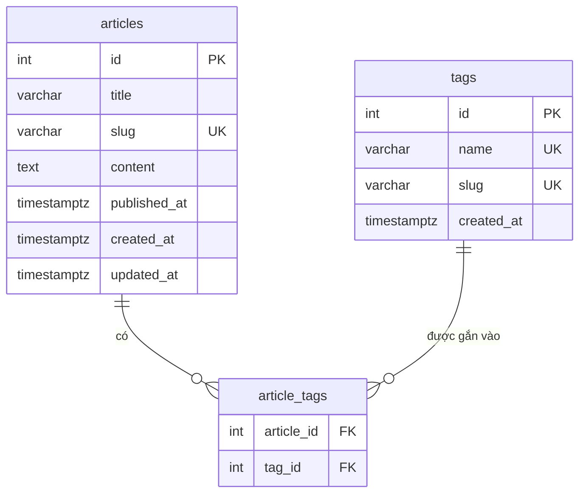

# Sơ đồ ERD — Mini-Wiki v1

> **ERD (Entity-Relationship Diagram):** Sơ đồ thực thể-quan hệ, dùng để mô tả cấu trúc dữ liệu: có những bảng nào, mỗi bảng có những cột gì, và các bảng liên kết với nhau như thế nào.
>
> **Phiên bản:** 1.0 (Chặng 1)

---

## 1. Các Thực thể (Entity)

### 1.1 `articles` — Bài viết

Bảng trung tâm của ứng dụng, lưu toàn bộ nội dung bài viết.

| Cột | Kiểu | Ràng buộc | Ghi chú |
|---|---|---|---|
| `id` | `INT` | PK, AUTO_INCREMENT | Khóa chính nội bộ |
| `title` | `VARCHAR(255)` | NOT NULL | Tiêu đề bài viết |
| `slug` | `VARCHAR(255)` | NOT NULL, UNIQUE | URL-friendly identifier, tự sinh từ `title`, hỗ trợ tiếng Việt |
| `content` | `TEXT` | NOT NULL | Nội dung dạng Markdown thuần |
| `published_at` | `TIMESTAMPTZ` | NULLABLE | NULL = bản nháp; có giá trị = đã đăng |
| `created_at` | `TIMESTAMPTZ` | NOT NULL, DEFAULT NOW() | Tự động ghi khi tạo |
| `updated_at` | `TIMESTAMPTZ` | NOT NULL | Tự động cập nhật khi sửa (Prisma @updatedAt) |

**Lý do `slug` là UNIQUE:** slug dùng làm định danh trong URL (`/articles/:slug`). Hai bài cùng slug sẽ gây xung đột routing — hệ thống phải chặn ở tầng DB bằng UNIQUE constraint, không chỉ kiểm tra ở application.

**Lý do tách `content` (TEXT) khỏi `title` (VARCHAR):** Nội dung Markdown có thể dài hàng chục nghìn ký tự; lưu TEXT tránh giới hạn VARCHAR. Đồng thời, khi hiển thị danh sách bài viết, ta chỉ cần `title + slug`, không cần kéo toàn bộ `content` — tách rõ giúp tối ưu query.

---

### 1.2 `tags` — Nhãn

Bảng lưu các nhãn phân loại. Một tag có thể gắn nhiều bài viết.

| Cột | Kiểu | Ràng buộc | Ghi chú |
|---|---|---|---|
| `id` | `INT` | PK, AUTO_INCREMENT | Khóa chính |
| `name` | `VARCHAR(100)` | NOT NULL, UNIQUE | Tên hiển thị của tag (ví dụ: "JavaScript") |
| `slug` | `VARCHAR(100)` | NOT NULL, UNIQUE | Dùng trong URL filter (ví dụ: `javascript`) |
| `created_at` | `TIMESTAMPTZ` | NOT NULL, DEFAULT NOW() | Tự động ghi khi tạo |

---

### 1.3 `article_tags` — Bảng Nối (Junction Table)

Bảng trung gian thể hiện quan hệ **nhiều-nhiều** giữa `articles` và `tags`. Mỗi hàng biểu diễn một cặp (bài viết, tag).

| Cột | Kiểu | Ràng buộc | Ghi chú |
|---|---|---|---|
| `article_id` | `INT` | FK → articles.id, ON DELETE CASCADE | Khi xóa bài viết, liên kết tự xóa theo |
| `tag_id` | `INT` | FK → tags.id, ON DELETE RESTRICT | Khi tag còn liên kết bài viết, KHÔNG cho phép xóa tag |
| _(PK)_ | _(article_id, tag_id)_ | PRIMARY KEY composite | Ngăn gắn trùng tag vào cùng một bài |

**Tại sao cần bảng nối?** Quan hệ nhiều-nhiều không thể biểu diễn trực tiếp bằng 2 bảng — cần bảng thứ 3 làm "cầu nối". Ví dụ: bài "Học Git" có thể có cả tag "Git" lẫn "DevOps"; tag "Git" lại gắn với nhiều bài khác nhau. Bảng `article_tags` lưu tất cả các cặp (article_id, tag_id) hợp lệ.

**ON DELETE CASCADE vs RESTRICT:**
- `article_id` CASCADE: xóa bài → liên kết tag bị xóa theo (hợp lý, không cần giữ lại).
- `tag_id` RESTRICT: xóa tag khi còn bài gắn → DB từ chối, trả lỗi → tầng application phải bắt và trả 409 Conflict. Bảo vệ dữ liệu, tránh bài viết bị mất tag mà người dùng không hay.

---

## 2. Sơ đồ ERD (Mermaid)

> **Đọc sơ đồ:** `||--o{` nghĩa là "một" (||) bên trái liên kết với "không hoặc nhiều" (o{) bên phải.
> - Một `article` có thể có 0 hoặc nhiều hàng trong `article_tags`.
> - Một `tag` có thể xuất hiện trong 0 hoặc nhiều hàng `article_tags`.
> - Tổ hợp (article_id, tag_id) là duy nhất — một bài không thể gắn cùng một tag hai lần.

---

## 3. Index cần tạo

| Index | Bảng | Cột | Loại | Mục đích |
|---|---|---|---|---|
| `articles_slug_idx` | articles | slug | UNIQUE B-Tree | Tìm nhanh bài theo slug (URL lookup) |
| `articles_fts_idx` | articles | `to_tsvector('simple', title \|\| ' ' \|\| content)` | GIN | Full-Text Search — tìm kiếm toàn văn, hỗ trợ tiếng Việt qua dictionary `simple` |
| `tags_slug_idx` | tags | slug | UNIQUE B-Tree | Tìm tag theo slug |
| `article_tags_tag_idx` | article_tags | tag_id | B-Tree | Lọc bài theo tag hiệu quả |

> **GIN index (Generalized Inverted Index):** Kiểu index của PostgreSQL chuyên dùng cho tìm kiếm toàn văn. Thay vì index theo giá trị nguyên, GIN tách văn bản thành các từ (lexeme) rồi map ngược từ → danh sách hàng chứa từ đó → tìm rất nhanh. Dùng `to_tsvector('simple', ...)` thay vì `'vietnamese'` vì PostgreSQL không có dictionary tiếng Việt built-in; `'simple'` lowercase + loại bỏ dấu cách vẫn hoạt động tốt cho tìm kiếm cơ bản.
